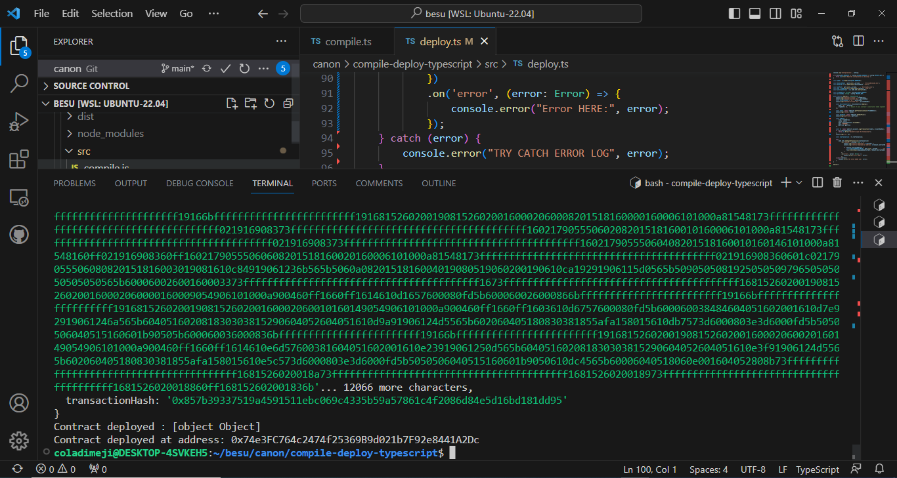

# canon
# Canon-besu
Open  Terminal

Create folder

Go to Github Fork on Github https://github.com/chrizteroo/Canon-besu

create folder Contacts inside create Utility.sol folder

Create another folder, this will be used for compile and deployment.

run npm init

Inside compile and deployment folder create compile.ts file and deploy.ts file

Create a folder name it types inside types folder create solc.ts file
NOTE: id you are using windows youneed to install
npm install -g typsescript
NOTE also make sure you have node.js installed
node --version
sudo apt install nodejs

navigate out of compile and deploy folder, to the project root

create tsconfig.ts file

also create .env file

navigate back to compile and deploy folder

run npm install -- solc web3 dotenv

open terminal and open terminal pointing to compile and deploy folder
Run 

npm run compile

NOTE: check to see that all package bytes are installed correctly and there is no problem
Run

npm run deploy

see screen shots

deploy

